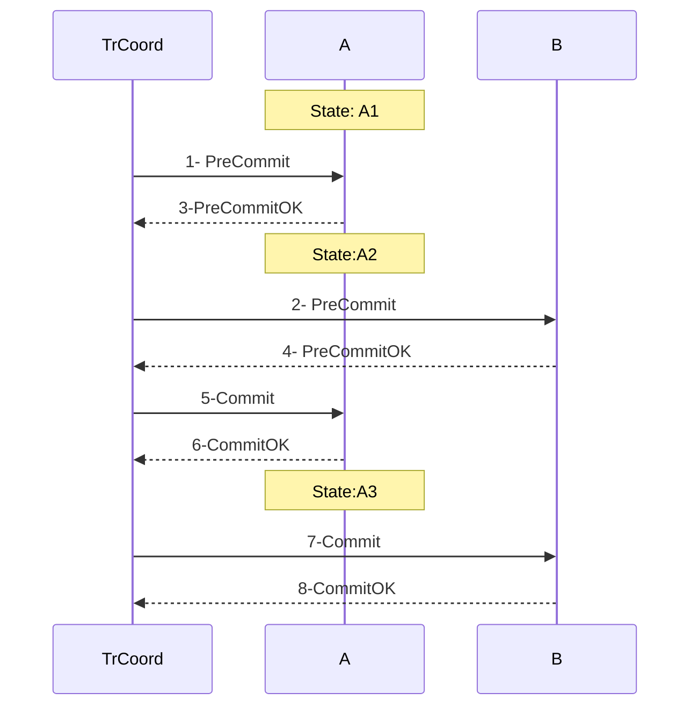
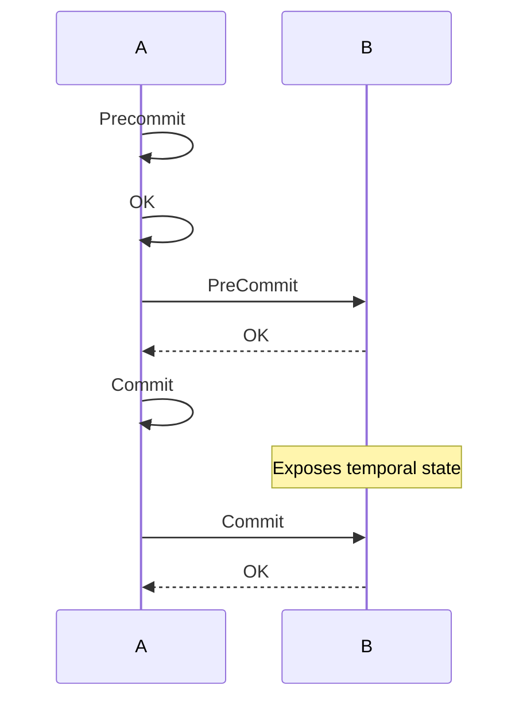
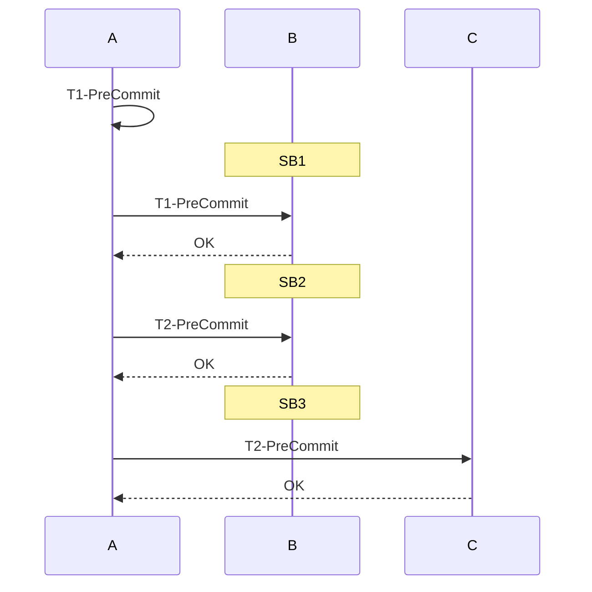
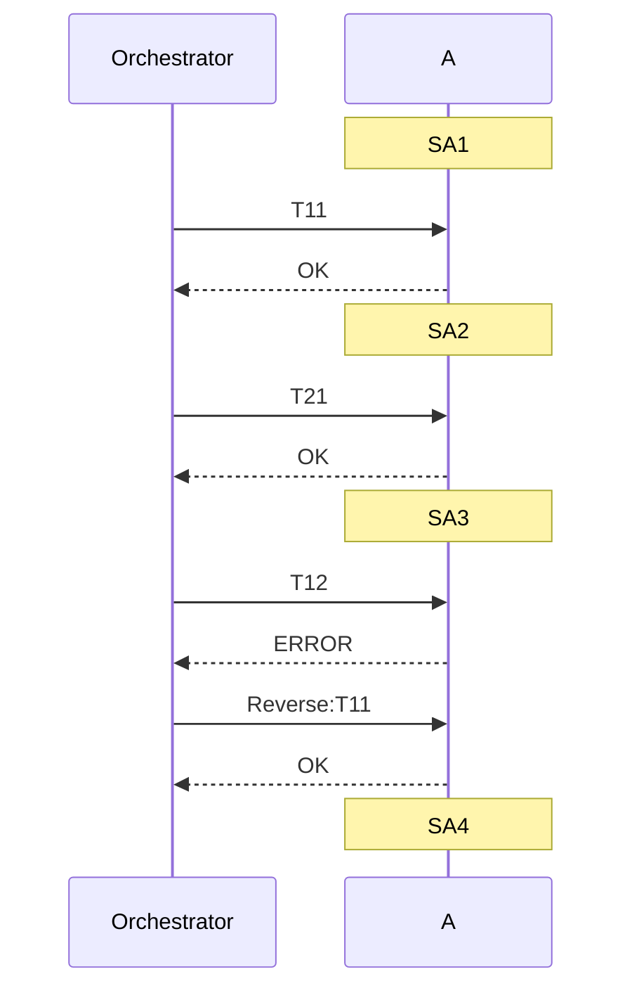
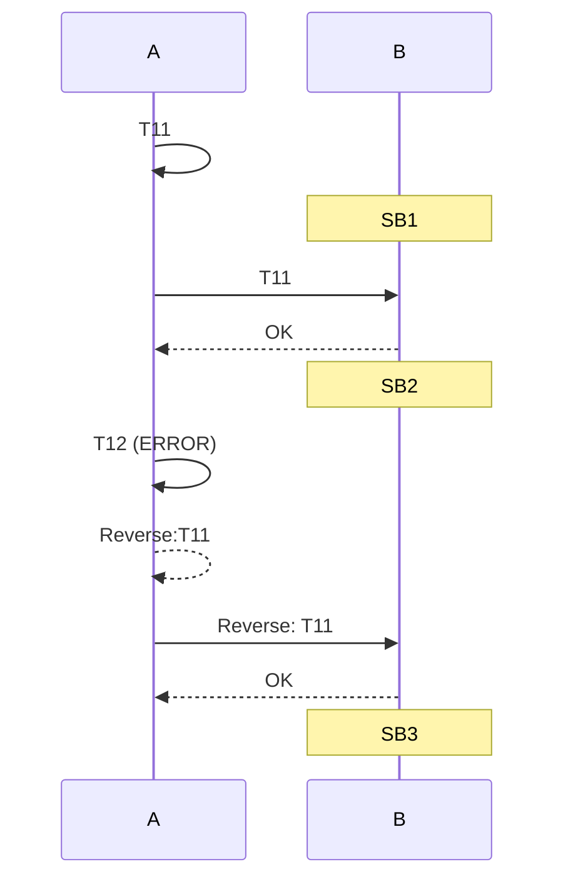

# A tour of Distributed Transactions

The goal of this post is to explain some patterns to implement distributed transactions. The reasoning that will move us from one to another will hopefully help to have a better understanding of them.

## Contents
- [Generic problem description](#classic-two-phase-commit) 
- [An example in Banking](#an-example-in-banking) 
- [Classic Two Phase Commit](#3classic-two-phase-commit)
- [Two Phase Commit with elected coordinator](#2pc-with-elected-coordinator)

## 1. Generic problem description

In a distributed context, a transaction has to be completed. 

- The transaction involves two distributed elements. i.e. nodes in a cluster, microservices, actors in akka cluster, etc ... 

- Each distributed element holds state

- Transaction has to be executed keeping ACID properties but we will focus in:
    - Consistency: The transaction takes place at once or it doesn't happened at all
    - Isolation: Multiple concurrent transactions occurs independently without interference.

We assume that messages can be sent to distributed elements to perform operations that changes its state. We also assume that, to preserve state integrity, a distributed element will process received message in sequence to avoid concurrent message executions to mutate the state at the same time.

For performance reasons we cannot use a global lock to isolate state mutability. We have to find the best solution without it.

## 2. An example in Banking

To make it easy to reason about, we will think of distributed elements being bank accounts and a transaction a financial transaction moving funds from one account to another.
Each account will hold its balances as state. Transaction will have a origin account from which money will be withdrawed and a destination account where money will land.

Accounts can not allow their balance to go negative so a transaction will fail if there's not enough funds in origin account. Let's call this a bussiness rule. Transaction can also fail because a bussiness rule is vilolated in destination account. Let's say the transaction could fail because of some security checks.
So we have a transaction to execute involving 2 distributed accounts and the execution can fail in any of them. 

## 3. Classic Two Phase Commit

The first solution attempt will be by implementing the 2PC pattern.
https://martinfowler.com/articles/patterns-of-distributed-systems/two-phase-commit.html
So there will be a Transaction Coordinator that executes the transaction in two phases: PreCommit, Commit/Revert

In the PreCommit phase the account will check business rules and reserve/adquire resources that will be needed to execute the transaction. So basically, in successful case, the PreCommit will result in a promise to carry out the state modification in the Commit phase, respecting the business rules, of course.

The Transaction Coordinator will send PreCommit messages to both accounts and, if all of them succeeded, it will send Commit message to both. In case of some PreCommit failed, it will send Revert message so the account can release resources reserved in PreCommit.

In our bancking example, origin account will have to reserve funds in PreCommit phase. Lets say the account has 10 dollars, we have to execute a transaction T1 for the value of 4, so we reserve 4 dollars in the PreCommit phase. That will prevent another PreCommit of T2 for 7 dollars to succeed if it's received between T1 Precommit and T1 Commit. In this example, if no reservation is done in the PreCommit, the Commit of T2 would cause a negative balance.

In the picture a TransactionCoordinator implements a 2PC to executing a transaction involving accounts A and B.

**Drawback**

Example: A second transaction starts concurrently with a PreCommit to A just after 3-PreCommitOk. This second transaction will see state A2 which will be reverted if 2-PreCommit fails. So this second transaction will have a dirty read! and this would violate the isolation principle.

**A Disapointiong conclusion**: Breaking down the transaction in steps (PreCommitA, PrecommitB, CommitA and CommitB) makes the state of a certain account to be modified gradually allowing dirty reads.
We respect atomicity but we don't have isolation.

**A solution!**

But wait, if executing multiple transaction concurrently is causing dirty reads, why we don't reduce concurrency by letting one distributed element be the transaction coordinator? Let's give it a try!

## 4. 2PC with Elected Coordinator

So given a transaction involving distributed elements A and B, we are going to elect one of them as the transaction coordinator. This can be done applying some specific strategy if it make sense for the business but in case of banking we are going to always elect origin account as Transaction Coordinator. Let's see how it goes:

A couple of things have changed in this new implementation. In Classic 2PC accounts received messages PreCommit, Commit and Reverse but now we add the Transaction itself, as a message that is send to the account that has been elected as the transaction coordinador. 
Remember that the messages for the same account are executed in order to preserve the state's integrity, so while account A is executing this transaction it cannot execute another command like PreCommit from other transaction. So no dirty read in A. 

However, account B could receive a PreCommit command before B's Commit. In that case the readed state after B PreCommit will not be reverted in anycase because A would have sent PreCommit to B only if it's own PreCommit has been succeeded. So in this case B exposes a temporal state that can be seen by another transaction. This is a dirty read but we would only see states of successful transactions, intermediate states of failed transactions would not be exposed. The transaction is not fully isolated but I would say we are in a better situation.  

# Still there...? 

## 5- Extra layer of transactionallity
We have a change in requirements! I love agile...

From now on we will have a new concept called Transaction Group. A Transaction Group can contain one or more transactions and they have to be processed with following constrains:

- Transactions have an order inside a group and they have to be processed sequentially inside the group keeping its original order.
- Transactions in the same group have to be processed trasactionally, so with atomicity and isolation.

So we have added another layer of transactionality. But don't panic! I know what todo...

## 6- Composite Two Phase Commit

The idea is to pick up solution '2PC with elected coordinator' and build a 2PC at Transaction Group level composing 2PC at individual transaction level. So the elected coordinator executes all PreCommits of all transactions in the Transaction Group, if all of them succeed, wi will execute all Commit phases for all transactions. Otherwise, execute all Rollbacks. Let's see how it looks like.

We will execute a Transaction Group with T1(from A to B) and T2(from B to C) in this order.

Let's take a look at the composite PreCommit phase:

State SB3 is wrong! T2-PreCommit should be applied to state of account B after the execution of T1 (remember transactions have to be processed in order inside its group). In this diagram T2-PreCommit will be calculated based on an intermediate state because T1 has not finish yet. 

__Problem__: Transaction phases are entangled and this violates requirement about sequencial execution 

## 7 SAGA pattern with Orchestration

We will have an external element called Transaction Orchestrator that will orchestrate the execution of the transaction following the SAGA pattern. Orchestrator will sent the transactions to distributed elements to be executed and results will be collected. If all results are OK nothing else will be done and transaction will be completed. Otherwise, in case of error, a compensation message will be sent to the distributed element so it will revert changes in state done in the previous command.

Imagine we execute two Transaction Groups concurrently.
Group 1: T11 (from A to B), T12 (from A to D)
Group 2: T21 (from A to C)

We will refer to first transaction of the first group as T11, second transaction of the first group as T12, etc...

Let's focus in account A. As we process the two groups concurrently imagine the following sequence is applied:

The problem here is that T21, first transaction of second group, has been computed with the result state of applying T11 which will end up being reverted because the failing of T12. So SA3 is calculated basing on SA2 instead of SA1.
In other words, T21 will suffer a dirty read.

## SAGA with elected coordinator

Once again we can leaverage the fact that each distributed element will execute received messages in order, to send a message to the distributed element containing the Transaction Group with all its transactions so this element will act as the elected coordinator. In this way we can reduce the concurrency, at least at one account...

Imagine we execute two Transaction Groups concurrently.
Group 1: T11 (from A to B), T12 (from A to D)
Group 2: T21 (from A to C)

We send Group1 to A as elected coordinator:

Looks good but B is temporally in wrong state
Group3 with T31 from B to D can be started concurrenly when B is in SB2 so it will be again a dirty read because SB2 is going to be reverted.

## Conclusion

Without a global lock, looks like we can have atomicity in transactions but not full isolation. However, we can achieve certain levels of isolation that can be part of an acceptable trade-off between performance and isolation.